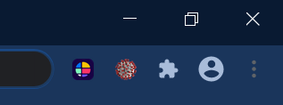

# COVID-19 Meter
Chrome browser extension that hides/ brings more attention to 'covid' related keywords on a webpage. 

### File Description
File/Folder | Description
------------ | -------------
[manifest.json](https://github.com/jonathanarava/COVID-19-Meter/blob/master/manifest.json) (file) | required file that 'stiches' together the files in the project.
[style.css](https://github.com/jonathanarava/COVID-19-Meter/blob/master/style.css) style (file) | css file.
[content.js](https://github.com/jonathanarava/COVID-19-Meter/blob/master/content.js) (file) | code to alter the website itself.
[background.js](https://github.com/jonathanarava/COVID-19-Meter/blob/master/background.js) (file) | code pertaining to the chrome browser (optional).   
[pop](https://github.com/jonathanarava/COVID-19-Meter/blob/master/pop) (folder) | holds the JS, HTML and CSS file that renders the pop-up (Figure 2).
[images](https://github.com/jonathanarava/COVID-19-Meter/blob/master/images) (folder) | COVID-19 browser extention favicon.


###### Figure 1: 'COVID-19 Meter' Favicon



###### Figure 2: 'COVID-19 Meter' Menu


### COVID-19 Meter pop-up menu options:
Option | Description
------------ | -------------
**MIN** | removes 'covid' related keywords from a webpage.
**I** (default) | re-loads webpage.
**MAX** | changes the font style of 'covid' related keywords to dynamic rainbow font.

### COVID keywords
List of COVID keywords can be found in the [content.js](https://github.com/jonathanarava/COVID-19-Meter/blob/master/content.js) file. As you can see more keywords can be easily added.
Alternatively, the contents of the tag_words variable can be completely replaced with keywords for some 
other topic.
```JS
  tag_words = [/(coronavirus)/gi, /(covid-19)/gi];

```
  
  
